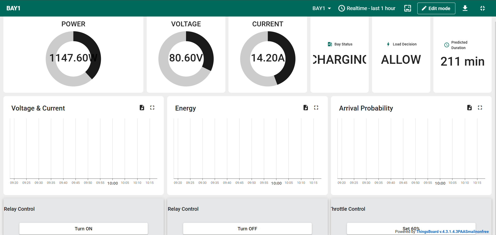

# BAY1 – IoT Charging Station

An ESP32-based Industrial IoT (IIoT) charging-station prototype for real-time monitoring, remote control, telemetry, and decision-support through ThingsBoard.

## Project Overview

BAY1 connects electrical and environmental sensing, relay control, local indicators, and an ESP32 controller to a ThingsBoard cloud dashboard. The system publishes charging-station telemetry through MQTT and supports remote control through ThingsBoard RPC.

### Key Features

- Real-time voltage, current, and power monitoring
- DHT22 environmental sensing
- Charging-bay status indication
- Relay-based load control
- Plugin / plugout inputs
- Green, yellow, and red status LEDs
- MQTT telemetry to ThingsBoard
- ThingsBoard RPC for remote relay and throttle control
- Dashboard widgets for:
  - Power
  - Voltage
  - Current
  - Bay Status
  - Load Decision
  - Predicted Duration
  - Voltage & Current trends
  - Energy
  - Arrival Probability
- Modular C++ firmware structure
- PlatformIO-based development
- Wokwi test/simulation files included

## System Architecture

```text
Sensors / Inputs
      │
      ├── Voltage sensing
      ├── Current sensing
      ├── DHT22
      ├── Plugin button
      └── Plugout button
      │
      ▼
    ESP32
      │
      ├── Local relay control
      ├── Status LEDs
      ├── Telemetry processing
      └── Decision / optimization logic
      │
      ▼
   MQTT / Internet
      │
      ▼
 ThingsBoard Cloud
      │
      ├── Real-time telemetry
      ├── Dashboard visualization
      └── RPC commands
```

## Hardware

| Component | Purpose | ESP32 GPIO |
|---|---|---:|
| Voltage sensor | Voltage measurement | GPIO 34 |
| Current sensor | Current measurement | GPIO 35 |
| DHT22 | Temperature / humidity | GPIO 15 |
| Relay | Load control | GPIO 26 |
| Plugin button | Charging connection input | GPIO 32 |
| Plugout button | Charging disconnection input | GPIO 33 |
| Green LED | Normal / charging indication | GPIO 18 |
| Yellow LED | Warning / intermediate status | GPIO 19 |
| Red LED | Fault / alert indication | GPIO 21 |

> GPIO assignments are taken from the project's `include/config.h`. Verify sensor scaling and electrical interfacing before connecting hardware to a live charging system.

## Software Stack

- ESP32
- C++
- PlatformIO
- Arduino framework
- MQTT
- ThingsBoard Cloud
- Wokwi for simulation/testing
- Git / GitHub

## ThingsBoard Dashboard

The dashboard provides a single-screen view of the BAY1 charging station.



Typical dashboard information includes:

- Instantaneous power
- Voltage
- Current
- Charging state
- Load decision
- Predicted charging duration
- Historical voltage/current
- Energy trend
- Arrival probability
- Relay control
- Throttle control

## Firmware Structure

```text
BAY1/
├── include/
│   ├── config.h
│   ├── secrets.example.h
│   ├── network.h
│   ├── rpc.h
│   ├── telemetry.h
│   ├── optimization.h
│   ├── edge_ai.h
│   ├── attributes.h
│   └── Peripherals.h
├── src/
│   ├── main.cpp
│   ├── config.cpp
│   ├── network.cpp
│   ├── rpc.cpp
│   ├── telemetry.cpp
│   ├── optimization.cpp
│   ├── edge_ai.cpp
│   ├── attributes.cpp
│   ├── Peripherals.cpp
│   └── State.cpp
├── lib/
├── test/
├── platformio.ini
└── .gitignore
```

## Secure Configuration

Credentials must never be committed to GitHub.

Create a local file:

```text
include/secrets.h
```

using the template:

```text
include/secrets.example.h
```

Then define your local Wi-Fi and ThingsBoard credentials in `secrets.h`.

`secrets.h` is intentionally excluded by `.gitignore`.

Example:

```cpp
#ifndef SECRETS_H
#define SECRETS_H

#define SECRET_WIFI_SSID "YOUR_WIFI_SSID"
#define SECRET_WIFI_PASS "YOUR_WIFI_PASSWORD"
#define SECRET_TB_TOKEN "YOUR_THINGSBOARD_DEVICE_TOKEN"

#endif
```

Do not publish real passwords, access tokens, API keys, or private credentials.

## Setup

### 1. Clone the repository

```bash
git clone https://github.com/palash-30/IoT-Charging-Station.git
cd IoT-Charging-Station
```

### 2. Open with PlatformIO

Open the project folder in VS Code with the PlatformIO extension installed.

### 3. Create the local secret file

Copy:

```text
include/secrets.example.h
```

to:

```text
include/secrets.h
```

Enter your own credentials in `secrets.h`.

### 4. Build

```bash
pio run
```

### 5. Upload

Connect the ESP32 and run:

```bash
pio run --target upload
```

### 6. Monitor

```bash
pio device monitor
```

Use the baud rate configured by the firmware / PlatformIO project.

## MQTT / ThingsBoard

The project uses ThingsBoard MQTT connectivity for device telemetry and remote control.

Typical telemetry can include:

```text
voltage
current
power
energy
bay_status
load_decision
predicted_duration
arrival_probability
```

Remote commands can be implemented through ThingsBoard RPC for functions such as relay control and charging-throttle control.

## Simulation

The repository contains Wokwi configuration files under:

```text
test/
```

Use the project's Wokwi files for firmware-level simulation and functional testing where supported.

## Safety

This is a prototype / development project. Do not connect the circuit directly to hazardous mains or high-energy charging equipment without appropriate isolation, protection, engineering review, and applicable electrical and industrial safety requirements.

For an industrial charging deployment, validate:

- Electrical isolation
- Sensor ratings and calibration
- Relay/contactor ratings
- Overcurrent and overvoltage protection
- Earthing and protection systems
- Emergency shutdown
- Applicable charging and industrial standards
- Site-specific safety procedures

## Future Scope

- Multi-bay charging-station management
- Central dashboard for multiple stations
- Historical energy analytics
- Predictive maintenance
- Dynamic load balancing
- AI-assisted charging recommendations
- User / vehicle identification
- Advanced energy-cost optimization
- Alerts and notification workflows
- Production-grade authentication and device provisioning

## Author

**Palash K. Shende**  
Electronics & Telecommunication Engineering  
Embedded Systems / IIoT Project

## License

Add the license that matches how you want this project to be used.
